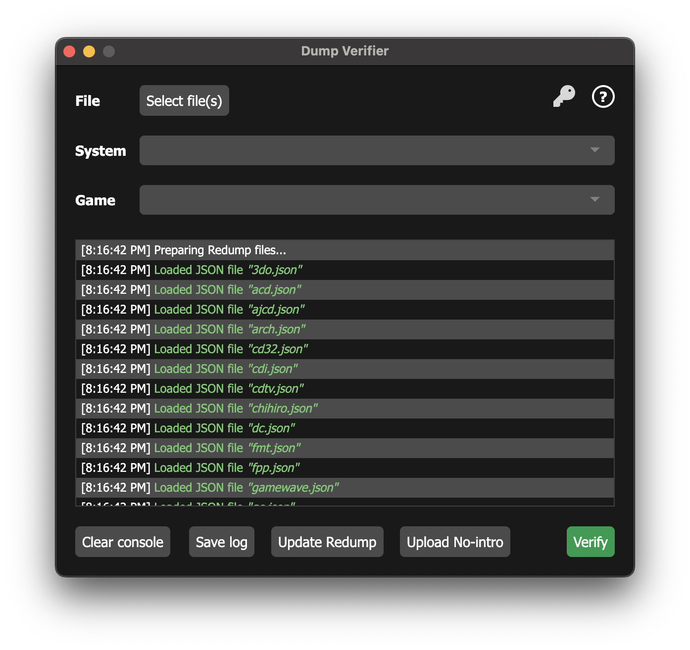

# Dump Verifier

An Electron app to verify game dumps using the `redump.org` and `no-intro.org` databases.

## Installation

### 1. Windows

From the releases page of this repository, download the latest `Windows executable` for your architecture (`ARM` or `x64`). Install the app by double clicking the downloaded file.

### 2. macOS

From the releases page of this repository, download the latest `compressed ZIP` file for your architecture (`ARM` or `x64`). Install the app by extracting it to the `Applications` folder.

### 3. Debian/Fedora based distributions

From the releases page of this repository, download the latest `.deb`/`.rpm` file for your architecture (`ARM` or `x64`). Install the app by navigating to the location of the downloaded file from a terminal and running `sudo apt install ./<package-name>`/`sudo rpm -i <package-name>`.

### 4. Other Linux distributions

If you would like to use this app on a different Linux distribution and you are familiar with Electron apps, clone this repository and modify the `package.json` to accommodate for your desired distribution. Then run `npm run watch` to generate all the `.css` and `.cjs`/`.js` files needed for compilation. That done, run `npm run make -- --arch=x64` or `npm run make -- --arch=arm64` from said distribution. You will find the built package under `./out/make`. 

As of the time of writing these instructions (31st of January of 2026), `.rpm` distributables can't be reliably packaged using `electron-maker-rpm` on the latest versions of Fedora and RPM. It may be necessary to make the change described [here](https://github.com/electron/forge/issues/3701).

## How to use

The application consists of the following elements:

* A button to select the game files to be verified.
* A gray key icon to log into `redump.org` and access to the `DAT` files reserved to users with dumper status. To do this:
  1. Click on the gray key icon. You will be taken to `forum.redump.org` to log in. If you have successfully logged in, the key will have turned yellow. This app does not store your credentials for security reasons so you will need to log in every time you open the app.
  2. Click on the `Update Redump` button to download all files again.
* A help symbol that will show a tooltip with some of the useful information detailed here when clicked on.
* A drop-down menu to select the database (i.e., `redump` or `no-intro`) and platform (e.g., `PlayStation`, `Nintendo DS`, `Xbox 360`, etc.) combination that you would like your file(s) to be compared against. If you are only verifying games for a single platform, this will help the application save some time comparing hashes. If you are verifying games for multiple platforms leave the text in this drop-down menu empty.
* Another drop-menu to select the specific game that you would like your file(s) to be compared against. If you are only verifying one game, this will help the application save some time comparing hashes. If you are verifying a multi-track PlayStation game, you want to set the drop-down menu to the specific game you would like to verify. The hash for the game file(s) will be produced by using the expected file size of the reference database game. This corresponds to the chunk of the game file containing the track with the game data.
* A console that logs all the actions performed by the app.
* A button to clear the console.
* A button to save the console logs.
* A button to update the reference `redump` database files. These are fetched automatically when the app is first launched after being installed. Clicking this button will delete the `redump` database files stored by the app and fetch them again.
* A button to upload the reference `no-intro` database files. These cannot be fetched automatically. Thus, it is necessary to:
  1. Visit `no-intro`'s `Dat-o-Matic` download page.
  2. Click on the `Request` button.
  3. Wait for the page to redirect you to a download (this may take a while).
  4. Click on the `Download` button.
  5. Click on the `Upload No-intro` button and select all the `DAT` files you downloaded at once. Any previously uploaded `DAT` files will be deleted and the new ones will be processed.
* A button to verify the currently selected game file(s).
